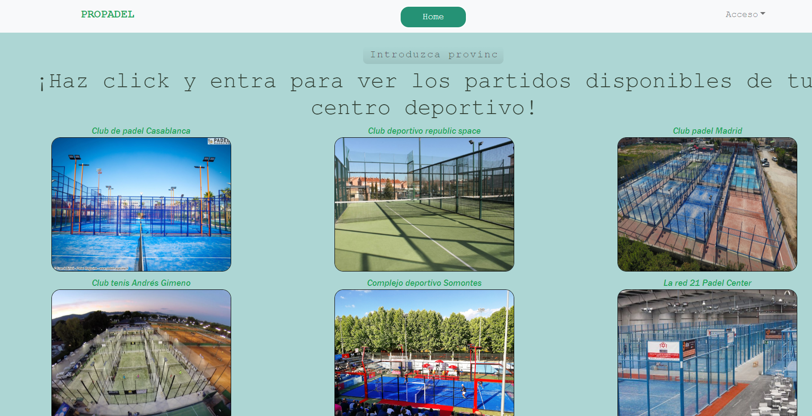
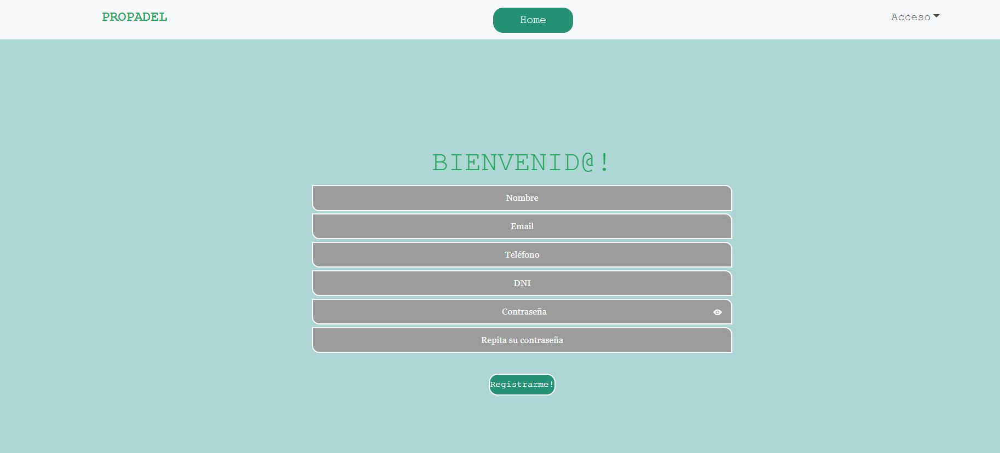
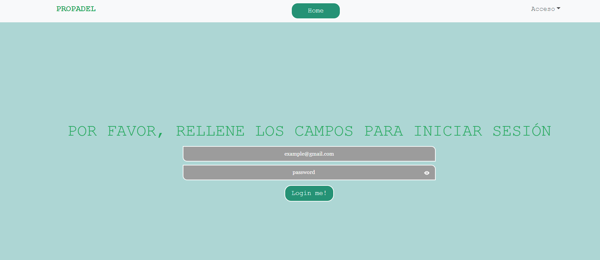
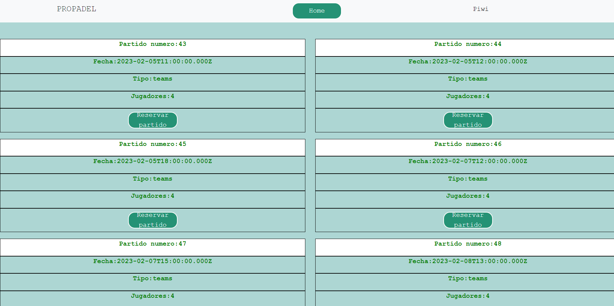
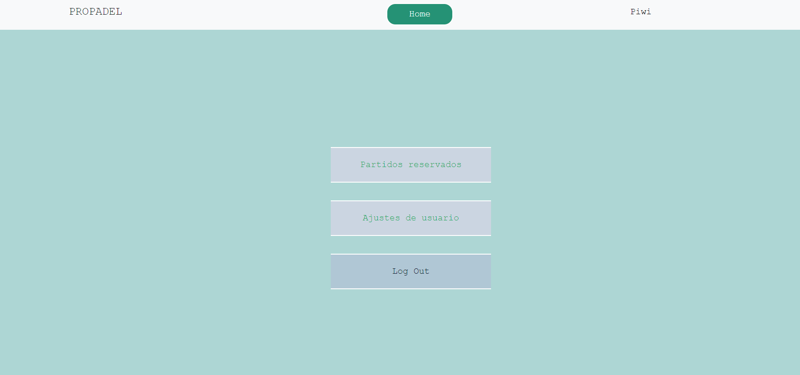
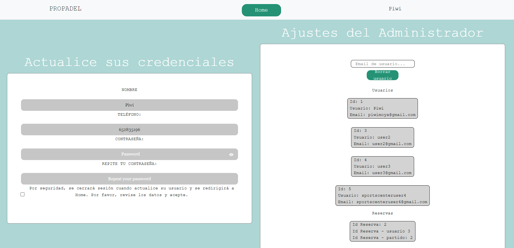
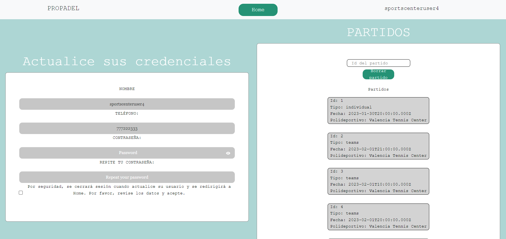
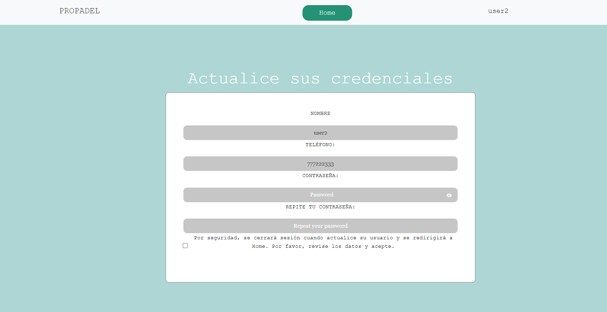

# PROPADEL

## Información general

Este proyecto consiste en el Front-End de una API de alquiler de partidos de padel realizado con React.

## Índice (#indice)

Algunas de las funcionalidades son:

- Mostrar todos los polideportivos
- Mostrar todos los polideportivos por provincia
- Mostrar todos los partidos
- Mostrar todos los partidos de un polideportivo
- Mostrar todas las reservas de partidos
- Registrar usuario
- Inicio de sesión de un usuario
- Modificar datos de usuario
- Mostrar todos los usuarios
- Eliminar un usuario
- Eliminar un partido

## Repositorios

[Front End](https://github.com/JavierMoyaSimo/FRONTEND-PROYECTO-FINAL#authors)

[Back End](https://github.com/JavierMoyaSimo/PROYECTO-FINAL)

---

---

## Vistas

Vista principal: 'Home'.
 

 

Vista de registro
 

 

Vista de Login
 

 

Vista de descripción de Polideportivo

 

 

Partidos de un polideportivo

 

 

Vista de perfil.

 

 

Vista de configuración (como admin).

 

 

Vista de configuración (como sportscenteradmin)

 

 

Vista de configuración (como usuario).

 

 

---

## Tecnologías, dependencias y librerías

Front End:

- [HTML5](https://html5.org/)
- [SCSS](https://sass-lang.com/)
- [CSS3](https://developer.mozilla.org/en-US/docs/Web/CSS)
- [JavaScript](https://www.javascript.com/)
- [ReactJS](https://es.reactjs.org/)
- [Redux](https://redux.js.org//)

Back End:

- [JavaScript](https://www.javascript.com/)
- [Node](https://nodejs.org/en/)
- [Express](https://expressjs.com/)
- [Sequelize](https://sequelize.org/)
- [Jwt-decode](https://jwt.io/)
- [Axios](https://axios-http.com//)
- [MySQL](https://www.mysql.com/)

---

## Autor

Javier Moya Simó

- [Linked In](https://www.linkedin.com/in/javier-moya-simo/)
- [Github](https://github.com/JavierMoyaSimo)

---

## Licencia

---

[Volver arriba](#indice)
